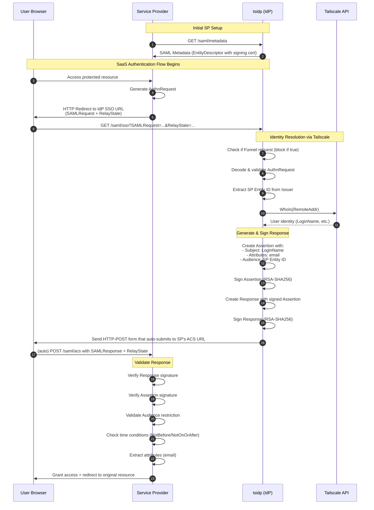

# SAML Implementation Plan for tsidp

## High Level Overview

tsidp (Tailscale IDP) is unique among identity providers - it leverages Tailscale's network identity for automatic authentication. Unlike typical OAuth or SAML IdPs that show a login page, tsidp knows the user's identity from the Tailscale network connection itself. This allows it to immediately complete the authentication flow and redirect back to the service provider.

This document specifies how to add SAML 2.0 IdP support to tsidp, parallel to the existing OIDC implementation.

## SAML Authentication Flow Diagram



## Architecture & Design

### Code Organization

- **server/saml.go** - All SAML handler implementations

  - Follow existing naming conventions (e.g., `serveMetadata()`, `serveSAMLSSO()`, `serveSAMLACS()`)
  - Functions designed for testability and isolation
  - Similar structure to existing OAuth handlers in server/authorize.go and server/token.go

- **server/saml_test.go** - Comprehensive test suite

  - Unit tests for metadata generation
  - Integration tests for SSO flow
  - Signature verification tests
  - Attribute statement tests

- **tsidp-server.go** - Add experimental flag
  - Add `-experimental-enable-saml` flag to enable SAML endpoints
  - SAML endpoints only registered when flag is set

### Dependencies

Use the same battle-tested SAML libraries as verifier-saml:

```go
"github.com/crewjam/saml"              // v0.5.1 - SAML 2.0 implementation
"github.com/russellhaering/goxmldsig"  // v1.5.0 - XML signature support (transitive)
"github.com/beevik/etree"              // XML tree manipulation (transitive)
```

### Integration with Existing tsidp

The SAML implementation should integrate seamlessly with tsidp's existing architecture:

1. **Identity Resolution** - Use existing `s.lc.WhoIs()` to get user identity from Tailscale connection
2. **State Management** - Leverage existing AuthRequest structure (or create SAMLAuthRequest if needed)
3. **Signing Keys** - Reuse existing signing key infrastructure from `s.oidcPrivateKey()`
4. **Server Configuration** - Use `s.serverURL` and `s.hostname` for endpoint URLs

## Core Requirements

### 1. SAML Metadata Endpoint ✅ CRITICAL

**Endpoint**: `GET /saml/metadata`

**Purpose**: Provides SAML metadata that service providers use to configure their SAML integration.

**Implementation**:

```go
func (s *IDPServer) serveSAMLMetadata(w http.ResponseWriter, r *http.Request) {
    // Generate EntityDescriptor with:
    // - EntityID: s.serverURL + "/saml"
    // - IDPSSODescriptor with:
    //   - protocolSupportEnumeration="urn:oasis:names:tc:SAML:2.0:protocol"
    //   - KeyDescriptor (signing) with X.509 certificate from s.oidcPrivateKey()
    //   - NameIDFormat: urn:oasis:names:tc:SAML:1.1:nameid-format:emailAddress
    //   - SingleSignOnService endpoints:
    //     - HTTP-Redirect: {serverURL}/saml/sso
    //     - HTTP-POST: {serverURL}/saml/sso
    //
    // Respond with XML: application/samlmetadata+xml
}
```

**Key Details**:

- Use `github.com/crewjam/saml.EntityDescriptor` structure
- Certificate from existing OIDC signing key
- Set proper cache headers (e.g., Cache-Control with reasonable TTL)
- Must pass metadata validation in verifier-saml

### 2. Single Sign-On (SSO) Endpoint ✅ CRITICAL

**Endpoint**: `GET /saml/sso` (HTTP-Redirect binding)

**Purpose**: Receives SAML AuthnRequest and initiates authentication.

**Implementation Flow**:

```go
func (s *IDPServer) serveSAMLSSO(w http.ResponseWriter, r *http.Request) {
    // 0. Block Funnel requests - SAML SSO requires Tailnet access for WhoIs
    //    This prevents authentication from outside the tailnet
    if isFunnelRequest(r) {
        writeHTTPError(w, r, http.StatusUnauthorized, ecAccessDenied,
            "SAML SSO not allowed over funnel", nil)
        return
    }

    // 1. Extract and decode SAMLRequest parameter
    //    - Base64 decode
    //    - Inflate (decompress)
    //    - Parse XML into saml.AuthnRequest

    // 2. Validate AuthnRequest
    //    - Valid XML structure
    //    - Has ID, IssueInstant, Destination
    //    - Destination matches this endpoint
    //    - AssertionConsumerServiceURL is present

    // 3. Extract SP Entity ID from AuthnRequest
    //    spEntityID := authnRequest.Issuer.Value
    //    - This is used for AudienceRestriction in the response
    //    - NO VERIFICATION: Any SP on the Tailnet can authenticate
    //    - Security model: Tailscale network access is the trust boundary

    // 4. Identify user via Tailscale
    //    conn := r.Context().Value(CtxConn{}).(net.Conn)
    //    who, err := s.lc.WhoIs(r.Context(), conn.RemoteAddr().String())
    //    - If error: return SAML error response (Responder/AuthnFailed)

    // 5. Generate SAML Response with Assertion
    //    - Create Response with:
    //      - InResponseTo: authnRequest.ID
    //      - Destination: authnRequest.AssertionConsumerServiceURL
    //      - Status: Success
    //    - Create Assertion with:
    //      - Subject: NameID = who.UserProfile.LoginName
    //      - Conditions: NotBefore/NotOnOrAfter (5 min validity)
    //      - AudienceRestriction: spEntityID (from step 3)
    //      - AuthnStatement: AuthnInstant = now, AuthnContext = PasswordProtectedTransport
    //      - AttributeStatement with standard attributes:
    //        - email: who.UserProfile.LoginName
    //    - Sign the Assertion with RSA-SHA256
    //    - Sign the Response with RSA-SHA256

    // 6. Respond with HTTP-POST binding
    //    - Base64 encode the signed SAML Response XML
    //    - Return HTML form with auto-submit JavaScript
    //    - Form posts to AssertionConsumerServiceURL with SAMLResponse parameter
    //    - **IMPORTANT**: Include RelayState parameter if present in request
    //    - **ERROR RESPONSES**: Always use HTTP-POST binding for errors, even if
    //      request came via HTTP-Redirect. Generate HTML form with SAMLResponse
    //      containing the error status.
}
```

**Key Details**:

- Support both HTTP-Redirect (GET) and HTTP-POST bindings for receiving AuthnRequest
- Always respond with HTTP-POST binding
- Use RSA-SHA256 for signatures (minimum 2048-bit keys)
- Include proper XML namespaces and canonicalization (C14N)
- Must pass all verifier-saml validation checks

**Security Model**:

- **Tailnet-only access**: SSO endpoint blocked for Funnel requests via `isFunnelRequest(r)` guard
- **No SP verification**: SP Entity ID extracted from AuthnRequest but not validated against a registry
- **Trust boundary**: Tailscale network access control is the primary security mechanism
- **Audience restriction**: SP Entity ID included in assertion to prevent token theft/replay

**SP Entity ID Handling**:

The SP Entity ID is a unique identifier for the Service Provider (similar to OAuth `client_id`). Here's how tsidp handles it:

1. **Extraction**: Extract from `AuthnRequest.Issuer.Value` (e.g., `"http://localhost:58080/saml"`)
2. **Purpose**: Used in the assertion's `AudienceRestriction` to ensure the assertion is only valid for that specific SP
3. **No Verification**: For Tailnet-only access, tsidp does NOT verify the SP Entity ID against a registry
4. **Security**: The SP's validation of the audience restriction prevents assertion theft/reuse

Example flow:

```
1. SP sends AuthnRequest with <Issuer>http://sp.example.com/saml</Issuer>
2. tsidp extracts "http://sp.example.com/saml" as spEntityID
3. tsidp includes it in assertion: <Audience>http://sp.example.com/saml</Audience>
4. SP validates that the audience matches its own entity ID
5. If assertion is stolen, other SPs will reject it (audience mismatch)
```

### 3. Response Generation & Signing ✅ CRITICAL

**Requirements**:

- **Signature Algorithm**: RSA-SHA256 or RSA-SHA512 (NEVER SHA-1)
- **Key Size**: Minimum 2048-bit RSA keys
- **Canonicalization**: Exclusive XML Canonicalization (C14N)
- **What to Sign**: Both Response and Assertion elements
- **Signature Order**: **CRITICAL** - Sign Assertion FIRST (inner signature), then sign Response (outer signature)
- **Certificate**: Include X.509 certificate in KeyInfo for validation

**Certificate Infrastructure**:

Since SAML requires an X.509 certificate (not just a private key like OIDC), we need to generate a self-signed certificate from the existing OIDC private key:

```go
// In server/saml.go - add helper function:
// Required imports for this function:
// import (
//     "crypto/rand"
//     "crypto/rsa"
//     "crypto/x509"
//     "crypto/x509/pkix"
//     "encoding/pem"
//     "fmt"
//     "math/big"
//     "os"
//     "path/filepath"
//     "time"
// )

func (s *IDPServer) samlCertificate() (*x509.Certificate, *rsa.PrivateKey, error) {
    sk, err := s.oidcPrivateKey()
    if err != nil {
        return nil, nil, err
    }

    // Check if certificate already exists
    certPath := "saml-cert.pem"
    if s.stateDir != "" {
        certPath = filepath.Join(s.stateDir, "saml-cert.pem")
    }
    certBytes, err := os.ReadFile(certPath)
    if err == nil {
        // Parse existing certificate
        block, _ := pem.Decode(certBytes)
        if block != nil {
            cert, err := x509.ParseCertificate(block.Bytes)
            if err == nil && time.Now().Before(cert.NotAfter) {
                return cert, sk.Key, nil
            }
        }
    }

    // Generate new self-signed certificate
    template := &x509.Certificate{
        SerialNumber: big.NewInt(1),
        Subject: pkix.Name{
            CommonName:   s.hostname,
            Organization: []string{"Tailscale IDP"},
        },
        NotBefore:             time.Now(),
        NotAfter:              time.Now().AddDate(10, 0, 0), // 10 years
        KeyUsage:              x509.KeyUsageDigitalSignature,
        ExtKeyUsage:           []x509.ExtKeyUsage{x509.ExtKeyUsageServerAuth},
        BasicConstraintsValid: true,
    }

    certDER, err := x509.CreateCertificate(rand.Reader, template, template, &sk.Key.PublicKey, sk.Key)
    if err != nil {
        return nil, nil, fmt.Errorf("failed to create certificate: %w", err)
    }

    cert, err := x509.ParseCertificate(certDER)
    if err != nil {
        return nil, nil, fmt.Errorf("failed to parse certificate: %w", err)
    }

    // Save certificate to disk
    certPEM := pem.EncodeToMemory(&pem.Block{Type: "CERTIFICATE", Bytes: certDER})
    if err := os.WriteFile(certPath, certPEM, 0600); err != nil {
        return nil, nil, fmt.Errorf("failed to save certificate: %w", err)
    }

    return cert, sk.Key, nil
}
```

**Implementation Notes**:

```go
// Use crewjam/saml's built-in signing:
cert, key, err := s.samlCertificate()
if err != nil {
    return err
}

idp := saml.IdentityProvider{
    Key:         key,
    Certificate: cert,
    MetadataURL: s.serverURL + "/saml/metadata",
    SSOURL:      s.serverURL + "/saml/sso",
}

// Create assertion with attributes
assertion := idp.NewAssertion(...)

// Create response - library handles signing in correct order:
// 1. Signs the Assertion first (inner signature)
// 2. Signs the Response second (outer signature)
response := idp.NewResponse(...)
```

### 4. Attribute Statements ✅ IMPORTANT

Provide standard SAML attributes for user information:

```go
// AttributeStatement in Assertion:
attributes := []saml.Attribute{
    {
        Name: "email",
        Values: []saml.AttributeValue{
            {Value: who.UserProfile.LoginName},
        },
    },
}
```

**Extensibility**: Consider future attributes based on WhoIs data:

- `displayName` (if available)
- `groups` (Tailscale tags/groups)
- `uid` (UserProfile.ID)

### 5. Error Handling ✅ CRITICAL

SAML defines specific error status codes. Implement proper error responses:

```go
// Error response structure
type SAMLError struct {
    StatusCode string  // e.g., "urn:oasis:names:tc:SAML:2.0:status:Responder"
    SubStatusCode string  // e.g., "urn:oasis:names:tc:SAML:2.0:status:AuthnFailed"
    StatusMessage string  // Human-readable message
}

// Common error cases:
// - AuthnRequest parsing failure -> Responder/RequestUnsupported
// - WhoIs fails (user not authenticated) -> Responder/AuthnFailed
// - Invalid destination -> Responder/RequestDenied
// - Signing failure -> Responder (generic)
```

**CRITICAL: Error Response Binding**

Error responses MUST use HTTP-POST binding, even when the AuthnRequest was received via HTTP-Redirect:

```go
func (s *IDPServer) sendSAMLError(w http.ResponseWriter, acsURL, inResponseTo, relayState string, statusCode, subStatusCode, statusMessage string) {
    // Create error Response with:
    // - Status.StatusCode.Value = statusCode
    // - Status.StatusCode.StatusCode.Value = subStatusCode (if present)
    // - Status.StatusMessage = statusMessage
    // - InResponseTo = inResponseTo (from original request)
    // - Destination = acsURL

    // Sign the error response
    // Marshal to XML and base64 encode
    // Return HTML form with auto-submit to ACS URL
    // Include both SAMLResponse and RelayState parameters
}
```

This ensures consistency with the SAML 2.0 spec and verifier-saml expectations.

### 6. Integration Points

#### Server Initialization (tsidp-server.go)

**Changes required in tsidp-server.go:**

```go
var (
    // ... existing flags ...
    flagEnableSAML = flag.Bool("experimental-enable-saml", false,
        "enable experimental SAML 2.0 IdP support")  // Flag to be added
)

// In main(), update the server.New() call:
srv := server.New(
    lc,
    *flagDir,
    *flagFunnel,
    *flagUseLocalTailscaled,
    *flagEnableSTS,
    *flagEnableSAML,  // Param to be added
)
```

#### Server.New() Signature Update

**Changes required in server/server.go:**

```go
// Update the New() function signature:
func New(lc *local.Client, stateDir string, funnel, localTSMode, enableSTS, enableSAML bool) *IDPServer {
    return &IDPServer{
        lc:            lc,
        stateDir:      stateDir,
        funnel:        funnel,
        localTSMode:   localTSMode,
        enableSTS:     enableSTS,
        enableSAML:    enableSAML,  // ADD THIS
        code:          make(map[string]*AuthRequest),
        accessToken:   make(map[string]*AuthRequest),
        refreshToken:  make(map[string]*AuthRequest),
        funnelClients: make(map[string]*FunnelClient),
    }
}
```

#### IDPServer Structure Update

**Changes required in server/server.go:**

```go
type IDPServer struct {
    // ... existing fields ...
    enableSTS   bool
    enableSAML  bool  // ADD THIS FIELD

    // ... rest of fields ...
}
```

#### Server Mux Registration (server/server.go)

**Changes required in newMux() function:**

```go
func (s *IDPServer) newMux() *http.ServeMux {
    mux := http.NewServeMux()

    // ... existing OIDC endpoints ...

    // SAML endpoints (only if enabled) - ADD THIS BLOCK
    if s.enableSAML {
        mux.HandleFunc("/saml/metadata", s.serveSAMLMetadata)
        mux.HandleFunc("/saml/sso", s.serveSAMLSSO)
    }

    return mux
}
```

## Testing Strategy

### Development Environment

Run tsidp with SAML enabled:

```bash
TAILSCALE_USE_WIP_CODE=1 go run . \
  -dir /Volumes/devdisk/tailscale-contract/tsidp-work-dir/ \
  -hostname idp-migration \
  -log debug \
  -experimental-enable-saml
```

### Verification with verifier-saml

Test the implementation using the SAML verifier. The verifier acts as a Service Provider (SP) and validates the IdP implementation.

#### Testing Flow

1. **Start verifier-saml** - This starts a local Assertion Consumer Service (ACS) on port 58080
2. **Browser interaction** - The verifier generates an AuthnRequest URL that you open in your browser
3. **tsidp processes request** - tsidp receives the request, authenticates via Tailscale, and generates a response
4. **Validation** - The verifier receives the response and validates signatures, attributes, and compliance

#### Basic Testing (Tailnet-only)

```bash
# Test metadata endpoint only (no SSO flow)
go run cmd/verifier-saml/verifier-saml.go \
  -v \
  -idp-metadata-url https://idp-migration.otter-skilift.ts.net/saml/metadata

# Test full SSO flow with browser interaction
# The verifier will:
# 1. Fetch metadata from tsidp
# 2. Start local ACS server on localhost:58080
# 3. Generate AuthnRequest and display URL
# 4. Wait for you to complete auth in browser
# 5. Validate the SAML response
go run cmd/verifier-saml/verifier-saml.go \
  -v \
  -idp-metadata-url https://idp-migration.otter-skilift.ts.net/saml/metadata
```

**Note**: The SP Entity ID is auto-generated by verifier-saml as `http://localhost:58080/saml` based on the ACS URL. The tsidp implementation doesn't need to know this in advance - it extracts the Issuer from the AuthnRequest.

#### Testing with Funnel (Public Internet)

If tsidp is running with `-funnel` enabled, you can test SAML from outside the tailnet:

```bash
# Run verifier-saml with funnel-compatible ACS URL
# You'll need to expose the verifier's ACS via funnel too
go run cmd/verifier-saml/verifier-saml.go \
  -v \
  -idp-metadata-url https://idp-migration.otter-skilift.ts.net/saml/metadata \
  -acs-url https://verifier.your-tailnet.ts.net/saml/acs \
  -sp-entity-id https://verifier.your-tailnet.ts.net/saml
```

#### Custom Port Testing

```bash
# If ACS port 58080 is in use, specify a different port
go run cmd/verifier-saml/verifier-saml.go \
  -v \
  -acs-port 58081 \
  -idp-metadata-url https://idp-migration.otter-skilift.ts.net/saml/metadata
```

#### What the Verifier Validates

The verifier performs comprehensive checks:

- ✅ Metadata structure and certificate validity
- ✅ HTTP-Redirect and HTTP-POST binding support
- ✅ Signature algorithms (rejects SHA-1, requires SHA-256+)
- ✅ Response and Assertion signatures
- ✅ InResponseTo matching
- ✅ Time-based conditions (NotBefore, NotOnOrAfter)
- ✅ Audience restrictions
- ✅ Required attributes (email)
- ✅ NameID presence
- ✅ AuthnStatement presence

### Unit Tests (server/saml_test.go)

```go
func TestServeSAMLMetadata(t *testing.T) {
    // Test metadata generation
    // Verify XML structure, certificate inclusion, endpoint URLs
}

func TestServeSAMLSSO_ValidRequest(t *testing.T) {
    // Test successful SSO flow with mock AuthnRequest
    // Verify Response generation, signatures, attributes
}

func TestServeSAMLSSO_InvalidRequest(t *testing.T) {
    // Test error handling for malformed requests
}

func TestSAMLSignatures(t *testing.T) {
    // Verify RSA-SHA256 usage
    // Test signature validation
}

func TestSAMLAttributes(t *testing.T) {
    // Verify attribute statement generation
    // Test with different WhoIs responses
}
```

## Implementation Checklist

### Phase 1: Basic Infrastructure

- [ ] Add `-experimental-enable-saml` flag to tsidp-server.go
- [ ] Update `server.New()` signature to accept `enableSAML` parameter
- [ ] Add `enableSAML` field to IDPServer struct in server/server.go
- [ ] Update `newMux()` to conditionally register SAML routes
- [ ] Create server/saml.go with basic structure
- [ ] Verify SAML dependencies in go.mod (already present)

### Phase 1b: Certificate Infrastructure

- [ ] Implement `samlCertificate()` helper function
- [ ] Add self-signed certificate generation from OIDC private key
- [ ] Store certificate in `{stateDir}/saml-cert.pem`
- [ ] Add certificate loading/caching logic
- [ ] Test certificate generation and persistence

### Phase 2: Metadata Endpoint

- [ ] Implement `serveSAMLMetadata()`
- [ ] Generate EntityDescriptor with proper structure
- [ ] Include X.509 certificate from OIDC signing key
- [ ] Test with verifier-saml metadata validation
- [ ] Write unit tests for metadata generation

### Phase 3: SSO Endpoint

- [ ] Implement `serveSAMLSSO()`
- [ ] Add Funnel request guard using `isFunnelRequest(r)` (block with Unauthorized error)
- [ ] Parse and decode AuthnRequest (HTTP-Redirect binding)
- [ ] Extract and preserve RelayState parameter
- [ ] Validate AuthnRequest structure
- [ ] Extract SP Entity ID from AuthnRequest.Issuer (no verification required)
- [ ] Integrate with WhoIs for identity resolution
- [ ] Generate SAML Response with Assertion
- [ ] Include SP Entity ID in AudienceRestriction
- [ ] Implement response signing (RSA-SHA256) - Assertion first, then Response
- [ ] Implement `sendSAMLError()` for error responses via HTTP-POST
- [ ] Generate HTTP-POST auto-submit form (include RelayState)
- [ ] Write unit tests for SSO flow
- [ ] Write unit tests for error handling
- [ ] Write unit test for Funnel request blocking

### Phase 4: Integration & Testing

- [ ] Test complete SSO flow with verifier-saml
- [ ] Verify all signatures validate correctly
- [ ] Test attribute extraction
- [ ] Test error cases (invalid requests, auth failures)
- [ ] Write integration tests

### Phase 5: Documentation & Polish

- [ ] Document SAML configuration for service providers
- [ ] Add example SP configurations (if needed)
- [ ] Update README with SAML support information
- [ ] Code review and cleanup

## Success Criteria

The SAML implementation is complete when:

1. ✅ `verifier-saml` passes all critical checks against tsidp
2. ✅ Metadata endpoint returns valid SAML 2.0 metadata
3. ✅ SSO flow completes successfully with proper Response generation
4. ✅ Signatures use RSA-SHA256 and validate correctly
5. ✅ Standard attributes (email) are present in assertions
6. ✅ Error handling returns proper SAML error responses
7. ✅ All unit and integration tests pass
8. ✅ Similar code quality and style to existing OIDC implementation

## Security Considerations

1. **Cryptography**:

   - Use RSA-SHA256 or stronger (NEVER SHA-1)
   - Minimum 2048-bit keys
   - Proper XML canonicalization for signatures

2. **Input Validation**:

   - Validate all AuthnRequest fields
   - Check Destination matches expected endpoint
   - Validate RelayState if present
   - Sanitize all XML inputs

3. **Response Security**:

   - Always sign both Response and Assertion
   - Set short validity windows (5 minutes)
   - Include Audience restrictions
   - Use secure AssertionConsumerServiceURL validation

4. **Identity Verification**:
   - Always verify Tailscale identity via WhoIs
   - Handle WhoIs failures gracefully
   - Log authentication attempts

## Future Enhancements

After the core implementation:

1. **SP Registry with Admin UI** - Allow registering SPs via admin UI
   - **Why**: Currently tsidp accepts any SP Entity ID without validation. Production environments need SP registration and verification.
   - **Value**: Improves security by validating SPs before authentication. Enables per-SP configuration (custom attributes, certificates). Provides audit trail of authorized SPs.
   - **Complexity**: Medium
     - Define minimal `SAMLServiceProvider` struct (similar to `FunnelClient`)
       - EntityID (string) - unique identifier for the SP
       - Name (string) - human-readable display name
       - ACSURLs ([]string) - list of valid Assertion Consumer Service URLs
       - Note: No metadata XML, certificates, or parsed EntityDescriptor stored
     - Add `samlServiceProviders map[string]*SAMLServiceProvider` to `IDPServer` struct
       - Key is Entity ID for O(1) lookup
     - Implement `storeSAMLServiceProvidersLocked()` for persistence (similar to `storeFunnelClientsLocked()`)
       - Store in `{stateDir}/saml-service-providers.json`
     - Load SP registry on startup in `loadState()`
     - Add SAML SP management UI pages (similar to OAuth client management in `ui.go`)
       - List view: Display registered SPs with Entity ID, name, and ACS URLs
       - Create/Edit form: Manual entry of Name, Entity ID, and ACS URLs (one per line)
       - Delete action: Remove SP from registry
       - No metadata XML upload/parsing in initial version
     - Add basic validation during form submission:
       - Entity ID format validation (valid URI)
       - ACS URL format validation (valid HTTPS/HTTP URLs)
       - Uniqueness check for Entity ID
     - Modify `serveSAMLSSO()` to validate SP during SSO flow:
       - Lookup Entity ID from AuthnRequest.Issuer in registry
       - Validate ACS URL from AuthnRequest matches one of the registered ACSURLs
       - Return SAML error if Entity ID not registered or ACS URL mismatch
     - **Deferred to future enhancement**: AuthnRequest signature verification
       - Rationale: Tailnet-only deployment has encrypted transport (low MITM risk)
       - Entity ID + ACS URL validation provides reasonable protection
       - Can add signature verification when Funnel support is needed

2. **Assertion Encryption** - Support for encrypted assertions (EncryptedAssertion)
   - **Why**: Some SPs require encrypted assertions for compliance (e.g., healthcare, financial services). Assertions can be intercepted during browser redirects if not encrypted.
   - **Value**: Enables tsidp to integrate with high-security SPs that mandate encryption. Protects sensitive user attributes in transit beyond just TLS.
   - **Complexity**: Medium
     - Import SP encryption certificates from SP metadata
     - Use `goxmldsig` or similar library for XML encryption (xmlenc)
     - Encrypt assertion with SP's public key before embedding in response
     - Support AES-128-CBC or AES-256-GCM encryption algorithms
     - Handle EncryptedAssertion element structure per SAML spec

3. **Advanced Attributes** - More user attributes from Tailscale (groups, tags)
   - **Why**: SPs often make authorization decisions based on group membership or roles. Currently only email is provided.
   - **Value**: Enables attribute-based access control (ABAC) in SPs. Allows SPs to grant different permissions based on Tailscale ACL tags or user groups.
   - **Complexity**: Low
     - Extract additional fields from `WhoIs` response (UserProfile.ID, tags, capabilities)
     - Map Tailscale tags/ACL groups to SAML group attributes
     - Add attributes to AttributeStatement (groups, uid, displayName)
     - Define standard attribute name mappings for common SP expectations
     - Add configuration for which attributes to include by default

4. **SAML Artifact Binding** - Support artifact binding in addition to POST
   - **Why**: Artifact binding keeps assertions server-side and only sends artifact IDs via browser. More secure for large assertions or sensitive data.
   - **Value**: Reduces exposure of assertion data in browser. Required by some enterprise SPs. Better for assertions larger than URL/form size limits.
   - **Complexity**: High
     - Implement artifact storage (in-memory cache with TTL or persistent store)
     - Generate unique artifact IDs (160-bit identifiers)
     - Add artifact resolution endpoint (POST /saml/artifact)
     - Support SOAP binding for artifact resolution requests
     - Validate artifact requests and return stored assertions
     - Handle artifact expiration and cleanup
     - Update metadata to advertise ArtifactResolutionService endpoint

6. **Attribute Mapping** - Configurable attribute names for different SPs
   - **Why**: Different SPs expect different attribute names (e.g., "email" vs "EmailAddress" vs "urn:oid:0.9.2342.19200300.100.1.3").
   - **Value**: Eliminates need for attribute transformation at SP side. Enables tsidp to work with SPs that have rigid attribute name requirements. Reduces SP-side configuration complexity.
   - **Complexity**: Medium
     - Design attribute mapping configuration format (JSON/YAML per SP)
     - Store mappings in SP registry (requires enhancement #4)
     - Define default attribute name templates (SAML 2.0 core, custom)
     - Implement mapping engine to transform attributes during assertion generation
     - Support attribute format types (URI, Basic, Unspecified)
     - Allow both simple name mapping and value transformation
